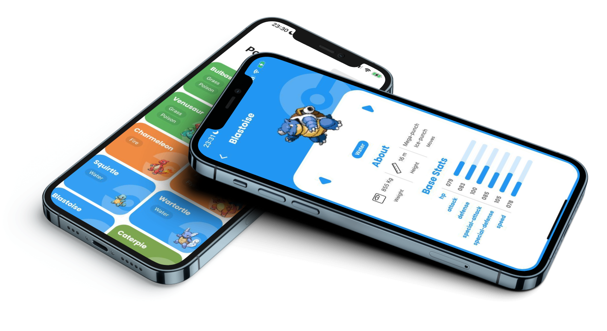

<!-- PROJECT LOGO -->
<br />
<div align="center">
  <a href="">
    
  </a>

  <h3 align="center">Poke App</h3>

  <p align="center">
    A Pokedex app to showcase all 151 pokemons from the first season!
    <br />
    
</div>

   <br />
<div align="center">

</div>
   <br />
<!-- ABOUT THE PROJECT -->

## About The Project


These project was made to showcase my flutter developer skills by creating an app that uses the api PokeApi to get pokemon information and display it in a beautiful fashion.


### Built With


* [Flutter](https://flutter.dev/)
* [Firebase](https://firebase.google.com/)
* [PokeApi](https://pokeapi.co/)


<!-- GETTING STARTED -->
## Getting Started
The app was made specially for iOS and Android devices. Nonetheless, some minor adjustments where made to use it on web too, and Firebase Hosting was used to make the deployment.

To see the Web app, just go to:
* [Poke App - Web](https://poke-app-668a2.web.app)

To see the Mobile version of the app please continue reading.

### Prerequisites
You need to have at least one of this installed:
 * VsCode
 * Xcode
 * Android Studio

 and be able to run the app on a emulator or real device.


### Installation with Flutter

1. Go to your favorite Ide and clone the repo inside the terminal:
  ```sh
   git clone https://github.com/dmintzer75/PokeApp.git
  ```

2. To be able to use Flutter, you should install it on your computer. 

   Folow this link for guidelines: https://docs.flutter.dev/get-started/install

3. Once you have Flutter SDK installed, go to the repository root and enter:

   ```sh
   flutter pub get
   ```

   This will get all the project dependencies.


4. Select an emulator or real device to install the app into and run: 
   ```sh
   flutter run
   ```
   The app should take a few minutes to install and run.


### Installation with XCode


1. Go to your terminal and clone the repo inside the terminal:
  ```sh
   git clone https://github.com/dmintzer75/PokeApp.git
  ```

2. Go to folder poke_app/ios/ and open Runner.xcworkspace file with XCode.


3. Wait for XCode to open the project (this make take several minutes) and then click on build. 
The app will be installed on the selected emulator (inside XCode) or on a real device if it was previously selected.
